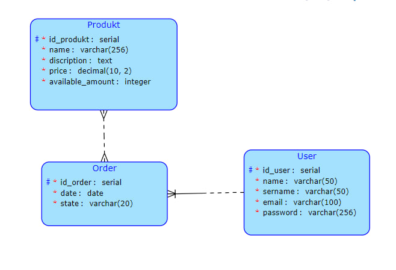

# Semestralni prace BI-TJV

Webová stránka obchodu. Uživatel <b>User</b> může vytvářet objednávky <b>Order</b> obsahující seznam produktů <b>Product</b>. Každý produkt může být v několika objednávkách a každá objednávka může obsahovat mnoho produktů.

## Schéma



## Dotaz

### Formulace
Vyberte všechny objednávky do daného data
### Použitím
Objednejte výstupní filtr

### Formulace
Vyberte všechny produkty, které jsou levnější než daná cena
### použitím
Filtr pro odstranění produktů

## Příprava a spuštění

Aplikace se skládá ze 2 částí:

API: https://gitlab.fit.cvut.cz/senykiva/bi-tjv-semestral-work

Client: https://gitlab.fit.cvut.cz/senykiva/bi-tjv-semestral-work
(selling-frontend)


Pro spuštění aplikace je potřeba mít stažené oba repozitáře a veškeré požadované nástroje:

### Požadavky

 - JVM
 - Gradle
 - Node.js

## Spuštění aplikace

### Client : 
V adresáři bi-tjv-semestral-work/selling-frontend

```bash
npm start
```

### API : 

Spustit projekt bi-tjv-semestral-work

Aplikace bude dostupná na adrese: http://localhost:4020/
